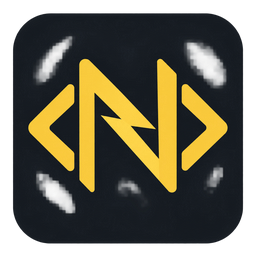
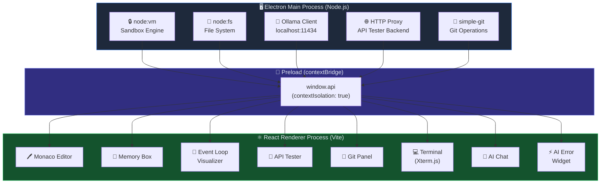
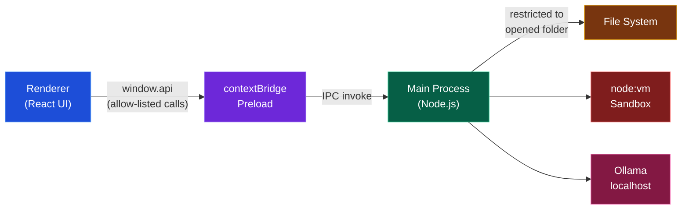
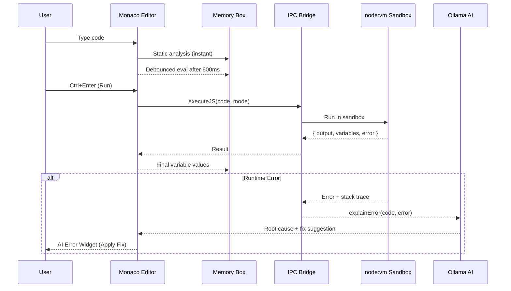
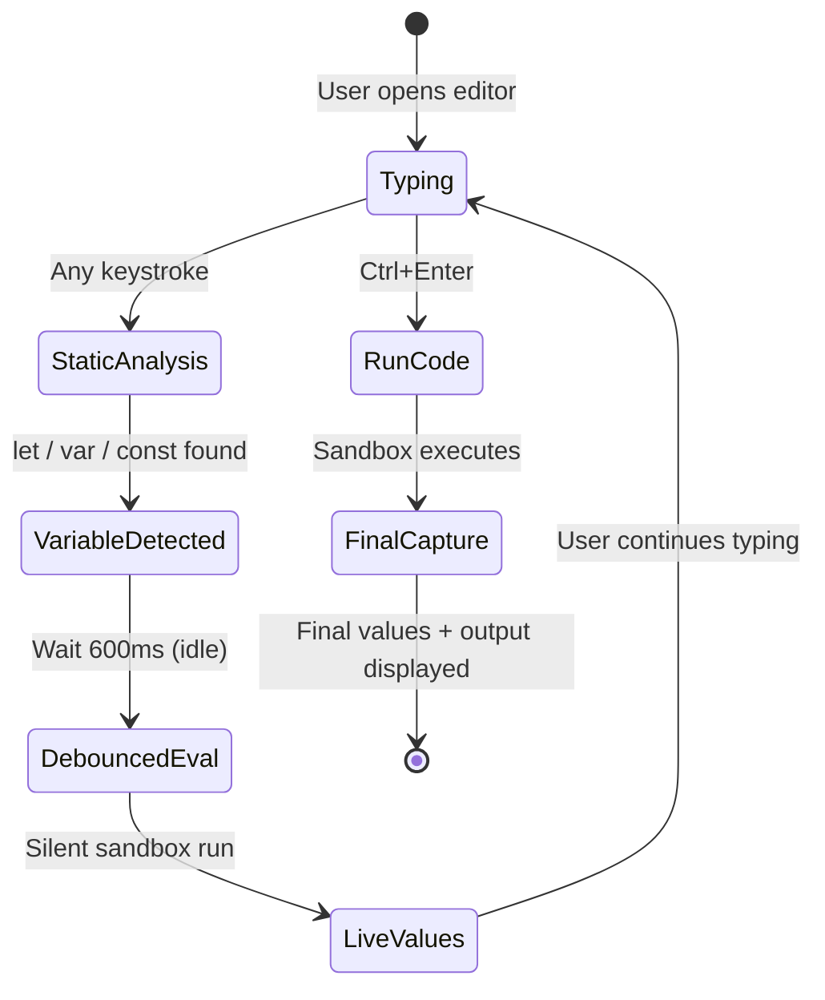
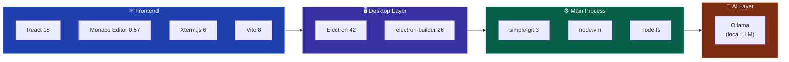
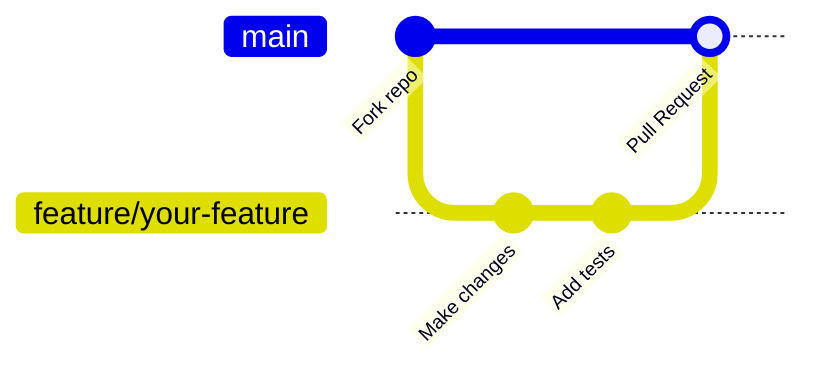

<div align="center">

<!-- Animated Banner -->


<br/>

# ⚡ JS Nexus

<p>
  <strong>A professional, offline-first JavaScript IDE</strong><br/>
  <sub>Built with Electron · React · Monaco Editor · Ollama AI</sub>
</p>

<br/>

<!-- Badges Row 1 -->
[](https://electronjs.org)
[](https://reactjs.org)
[](https://microsoft.github.io/monaco-editor/)
[](https://vitejs.dev)

<!-- Badges Row 2 -->
[](https://www.typescriptlang.org)
[](https://ollama.com)
[](LICENSE)
[]()

<br/>

<!-- Navigation Pills -->
[📖 Overview](#-overview) &nbsp;·&nbsp;
[✨ Features](#-features) &nbsp;·&nbsp;
[🏗️ Architecture](#️-architecture) &nbsp;·&nbsp;
[🛠️ Installation](#️-installation) &nbsp;·&nbsp;
[🚀 Usage](#-usage) &nbsp;·&nbsp;
[🧰 Tech Stack](#-tech-stack) &nbsp;·&nbsp;
[🤝 Contributing](#-contributing)

<br/>

---

</div>

## 📖 Overview

**JS Nexus** is a **professional desktop IDE** engineered exclusively for JavaScript developers. It merges a VS Code–grade editor with a live variable inspector, an animated event loop visualizer, a built-in API client, full Git source control, an embedded terminal, and a **100% offline AI assistant** — all without a single cloud dependency.

> 🔐 **Privacy-first by design.** Every computation — code execution, AI inference, Git operations — runs locally. Nothing ever leaves your machine.

<br/>

```
 JS Nexus = Monaco Editor + VM Sandbox + Memory Box + Event Loop + Git + AI (Ollama) + API Tester
```

<br/>

---

## ✨ Features

<table>
<tr>
<td width="50%">

### 🖊️ Professional Code Editor
- **Monaco Editor** — the exact engine powering VS Code
- Multi-tab management with unsaved-change indicators (`●`)
- Smart snippets: `clog`, `fn`, `forof`, `arr`, `prom`
- Bracket pair colorization & live IntelliSense
- `Ctrl+Enter` to run · `Ctrl+S` to save

</td>
<td width="50%">

### ⚡ Dual Execution Engine
| Mode | Description |
|------|-------------|
| **Node.js Engine** | Full I/O, native modules, real filesystem |
| **Sandbox VM** | `node:vm` isolated context, 5 s timeout |

Each mode exposes a different API surface, giving you full power or safe isolation with a single dropdown switch.

</td>
</tr>
<tr>
<td width="50%">

### 🧠 Memory Box *(Live Variable Inspector)*
The crown jewel of JS Nexus — updates **as you type**:
1. **Static analysis** — detects `let`/`var`/`const` instantly
2. **Debounced eval** — silent sandbox run every 600 ms
3. **Final capture** — post-run values with types & glow effects
4. Color-coded primitives, arrays, and objects

</td>
<td width="50%">

### 🔄 Event Loop Visualizer
Step-by-step animated walkthrough of JavaScript concurrency:
- **Call Stack** — function frame push/pop
- **Microtask Queue** — Promise resolution (high priority)
- **Macrotask Queue** — `setTimeout` / `setInterval`

Watch your async code execute frame-by-frame.

</td>
</tr>
<tr>
<td width="50%">

### 🤖 AI Error Interceptor
Automatic AI-powered debugging on every runtime error:
1. Captures error message, stack trace & source
2. Sends to local **Ollama** model (offline, zero telemetry)
3. Displays root cause + corrected code block
4. One-click **"Apply Fix"** patches the editor instantly

</td>
<td width="50%">

### 🔌 Built-in API Tester
A full Postman-style HTTP client embedded in the IDE:
- GET · POST · PUT · DELETE · PATCH
- Custom headers + JSON body editor
- Response viewer: status, latency, formatted body
- Runs via Electron IPC — no Express, no extra port

</td>
</tr>
<tr>
<td width="50%">

### 🌿 Git Integration
Full source control panel without leaving the IDE:
- Stage / unstage / commit changes
- Inline diff viewer per file
- Push, pull, branch checkout via `simple-git`

</td>
<td width="50%">

### 💻 Interactive Terminal
- **Xterm.js** embedded terminal in the workspace
- Runs shell commands in your open project directory
- Output coloring by JS type: `string`, `number`, `boolean`
- Execution benchmarks: timing + heap memory usage

</td>
</tr>
</table>

<br/>

---

## 🏗️ Architecture

JS Nexus follows Electron's **multi-process architecture** with strict context isolation for maximum security and stability.

### Process Diagram



### Security Model



| Security Property | Value |
|---|---|
| `nodeIntegration` | `false` |
| `contextIsolation` | `true` |
| `sandbox` (preload) | `true` |
| File access | Restricted to user-opened folder |
| External links | Allow-listed |
| File deletion | OS trash (reversible) |

### VM Variable Capture

The Memory Box appends **guarded capture expressions** after user code to extract final values without exposing Node.js internals:

```js
// ── Your code ─────────────────────────────────────────────────────
let score = 0;
score = 10;
score = score * 2;

const name = "JS Nexus";
var version = 1;

// ── Internally appended capture pass ──────────────────────────────
try { __capture__.score   = typeof score   === 'undefined' ? undefined : score;   } catch {}
try { __capture__.name    = typeof name    === 'undefined' ? undefined : name;    } catch {}
try { __capture__.version = typeof version === 'undefined' ? undefined : version; } catch {}
```

> ⚠️ `node:vm` is a **convenience boundary**, not a hostile-code sandbox. For adversarial input, pair it with an OS-level sandbox.

<br/>

---

## 🔄 Data Flow



<br/>

---

## 🛠️ Installation

### Prerequisites

| Requirement | Version | Link |
|---|---|---|
| **Node.js** | v20.19+ | [nodejs.org](https://nodejs.org) |
| **Git** | Any | [git-scm.com](https://git-scm.com) |
| **Ollama** *(optional)* | Latest | [ollama.com](https://ollama.com) |

### Quick Start

```bash
# 1. Clone the repository
git clone https://github.com/SaadRimeh/Js-Nexus.git
cd Js-Nexus

# 2. Install all dependencies
npm install

# 3. Launch the IDE in development mode
npm run dev
```

The Electron window opens automatically with Vite hot-reload enabled.

### AI Setup *(Optional — Fully Offline)*

```bash
# Install Ollama from https://ollama.com, then pull a coding model:
ollama pull codellama      # Recommended for code tasks
# or
ollama pull llama3         # General purpose
# or
ollama pull deepseek-coder # Specialized code model
```

> 💡 JS Nexus can also **auto-download models from within the IDE** — no terminal needed after the initial Ollama install.

### Build for Distribution

```bash
# Compile TypeScript + bundle React, then package the installer
npm run dist
# Output: dist/ directory with .exe (Windows) / .dmg (macOS) / .AppImage (Linux)
```

<br/>

---

## 🚀 Usage

### Keyboard Shortcuts

| Shortcut | Action |
|---|---|
| `Ctrl + Enter` | Run current code |
| `Ctrl + S` | Save current file |
| `Ctrl + Z` | Undo last change |
| `Ctrl + Shift + Z` | Redo |
| `Ctrl + /` | Toggle line comment |
| `F11` | Toggle fullscreen |

### Memory Box Workflow



**Try this example:**

```js
let score = 0;
score = 10;
score = score * 2;

for (let i = 0; i < 5; i++) {
  score = score + i;
}

const name = "JS Nexus";
var version = 1;
```

Watch the **Memory Box** panel on the right update live as you type, showing `score → 30`, `name → "JS Nexus"`, `version → 1`.

### Execution Mode Switch

Use the **dropdown in the editor toolbar** to switch engines:

| Engine | Use Case |
|---|---|
| **Node.js Engine** | File I/O, native modules, npm packages, shell interop |
| **Sandbox VM** | Safe isolated execution, Memory Box live inspection |

<br/>

---

## 📁 Project Structure

```
js-nexus/
├── 📁 electron/
│   ├── main.ts                   # Main process: VM engine, FS, Ollama, HTTP proxy, Git IPC
│   ├── preload.ts                # contextBridge: exposes window.api to renderer
│   └── electron-env.d.ts        # Electron type declarations
│
├── 📁 src/
│   ├── 📁 main/                  # Electron entry types
│   ├── 📁 preload/               # Preload type declarations
│   └── 📁 renderer/
│       ├── App.jsx               # Root layout, tabs, sidebar, state management
│       ├── main.jsx              # React entry point
│       └── 📁 components/
│           ├── Editor.jsx        # Monaco Editor wrapper + snippets + shortcuts
│           ├── MemoryBox.jsx     # Live variable inspector (static + runtime)
│           ├── Terminal.jsx      # Xterm.js terminal + type-colored output
│           ├── EventLoopVisualizer.jsx  # Animated call stack / queue viewer
│           ├── FileExplorer.jsx  # File tree: create, rename, delete, open folder
│           ├── GitPanel.jsx      # Stage, diff, commit, push, pull, branch
│           ├── ApiTester.jsx     # HTTP client (GET/POST/PUT/DELETE/PATCH)
│           ├── AiChat.jsx        # Ollama chat with code context injection
│           ├── AIErrorWidget.jsx # Auto-triggered AI debugger + Apply Fix
│           └── BrandLogo.jsx     # App logo component
│
├── 📁 public/
│   └── 📁 branding/             # Logo assets (PNG 32px – 1024px, ICO, ICNS)
│
├── 📁 scripts/
│   ├── generate-icons.cjs       # Icon generation utility
│   └── smoke-electron.cjs       # Smoke test runner
│
├── 📁 docs/
│   └── branding.md              # Brand guidelines
│
├── electron-builder.json5        # Installer / packaging configuration
├── vite.config.ts                # Vite + Electron plugin configuration
├── tsconfig.json                 # TypeScript project config
└── package.json                  # Scripts, deps, entry point
```

<br/>

---

## 🧰 Tech Stack



| Technology | Version | Role |
|---|---|---|
| [Electron](https://electronjs.org) | 42 | Desktop application framework |
| [React](https://reactjs.org) | 18 | UI rendering & state management |
| [Monaco Editor](https://microsoft.github.io/monaco-editor/) | 0.57 | VS Code editor engine |
| [Xterm.js](https://xtermjs.org) | 6 | Embedded terminal emulator |
| [Vite](https://vitejs.dev) | 8 | Bundler & hot-reload dev server |
| [TypeScript](https://typescriptlang.org) | 5 | Type-safe development |
| [simple-git](https://github.com/steveukx/git-js) | 3 | Git operations via IPC |
| [node:vm](https://nodejs.org/api/vm.html) | Built-in | Sandboxed JS execution context |
| [Ollama](https://ollama.com) | Latest | Offline local AI model runner |
| [electron-builder](https://electron.build) | 26 | Cross-platform packaging & installer |

<br/>

---

## 🤝 Contributing

Contributions, issues, and feature requests are welcome! Here's how to get started:



1. **Fork** the repository
2. **Create** your feature branch: `git checkout -b feature/amazing-feature`
3. **Commit** your changes: `git commit -m 'feat: add amazing feature'`
4. **Push** to the branch: `git push origin feature/amazing-feature`
5. **Open** a Pull Request on GitHub

### Commit Convention

Follow [Conventional Commits](https://www.conventionalcommits.org):

| Prefix | Use for |
|---|---|
| `feat:` | New features |
| `fix:` | Bug fixes |
| `docs:` | Documentation changes |
| `refactor:` | Code restructuring |
| `style:` | Formatting only |
| `chore:` | Build / tooling changes |

<br/>

---

## 📄 License

This project is licensed under the **MIT License** — see the [LICENSE](LICENSE) file for details.

```
MIT License — free to use, modify, and distribute with attribution.
```

<br/>

---

<div align="center">


<br/>

**Built with ❤️ by [Saad Rimeh](https://github.com/SaadRimeh)**

<br/>

[](https://github.com/SaadRimeh/Js-Nexus/stargazers)
[](https://github.com/SaadRimeh/Js-Nexus/network/members)
[](https://github.com/SaadRimeh/Js-Nexus/issues)

<br/>

⭐ **If JS Nexus helped you — drop a star, it means a lot!** ⭐

</div>
